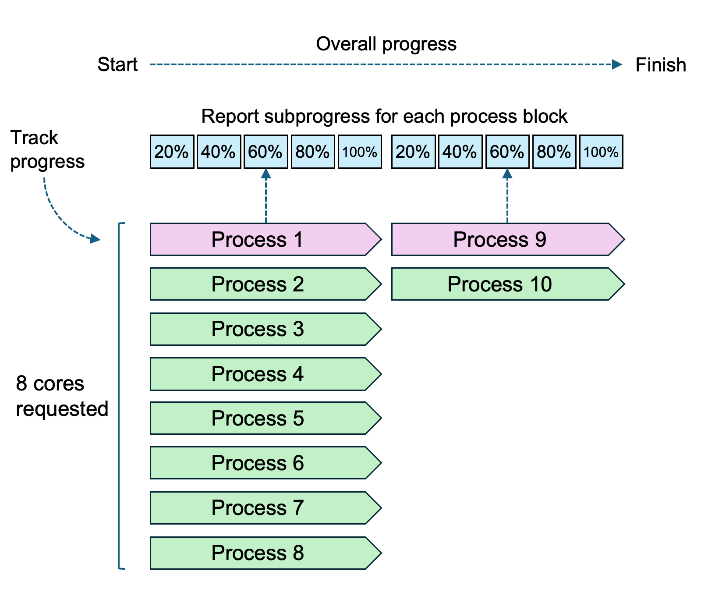

```{r, include = FALSE}
knitr::opts_chunk$set(
  collapse = TRUE
)
library(parallel)
```

# Installation

Install from CRAN
```{r eval = FALSE}
install.packages("mcprogress")
```

Install from Github
```{r eval = FALSE}
devtools::install_github("myles-lewis/mcprogress")
```

# Examples

## *mclapply* with progress bar

This package adds a progress bar to `mclapply()` using `echo` to output to the
console in Rstudio or Linux environments. Simply replace your original call to
`mclapply()` with `pmclapply()`.

```{r eval=FALSE}
library(mcprogress)

# toy example
res <- pmclapply(letters[1:20], function(i) {
                 Sys.sleep(0.2 + runif(1) * 0.1)
                 setNames(rnorm(5), paste0(i, 1:5))
                 }, mc.cores = 2, title = "Working")

```

```{r eval=FALSE}
Working  |================================                 |  60%  eta 3.1 secs
```

`pmclapply()` can be used in an identical manner to `mclapply()`. It is ideal
for use if the length of `X` is comparably > cores. As processes are spawned
in a block and most code for each process completes at roughly the same time,
processes move along in blocks as determined by `mc.cores`. To track
progress, `pmclapply` only tracks the nth process, where n=`mc.cores`. For
example, with 4 cores, `pmclapply` reports progress when the 4th, 8th, 12th,
16th etc process has completed.

```{r, out.width='80%', echo=FALSE}

```

ETA is approximate. As part of minimising overhead, it is only updated with
each change in progress (i.e. each time a block of processes completes). It
is not updated by interrupt.

## Tracking subprogress 

However, in some scenarios the length of `X` is comparable to the number of
cores and each process may take a long time. For example, machine learning
applied to each of 8 cross-validation folds on an 8-core machine will open 8
processes from the outset. Each process will often complete at roughly the
same time. In this case `pmclapply` is much less informative as it only shows
completion at the end of 1 round of processes, so it will go from 0% straight
to 100%.

For this scenario, we recommend users use `mcProgressBar()` which
allows more fine-grained reporting of subprogress from within a block of
parallel processes. The diagram below illustrates computation involving 10
processes to complete across 8 cores, with subprogress divided into 5 intervals.

```{r, out.width='65%', echo=FALSE}

```

Technically only 1 process can be tracked. If `cores` is set to 4 and `subval`
is invoked, then the 1st, 5th, 9th, 13th etc process is tracked. Subprogress of
this process is computed as part of the number of blocks of processes required.

In the next example, we build a custom function showing how to use
`mcProgressBar()` including a call to `mclapply` wrapped around another nested
function which can report subprogress.

```{r eval=FALSE}
library(parallel)

my_fun <- function(x, cores) {
  start <- Sys.time()
  mcProgressBar(0, title = "my_fun")  # initialise progress bar
  
  res <- mclapply(seq_along(x), function(i) {
    # inner loop of calculation
    y <- 1:4
    inner <- lapply(seq_along(y), function(j) {
      Sys.sleep(0.2 + runif(1) * 0.1)
      mcProgressBar(val = i, len = length(x), cores, subval = j / length(y),
                    title = "my_fun", start = start)
      rnorm(4)
    })
    inner
  }, mc.cores = cores)
  
  closeProgress(start, title = "my_fun")  # finalise the progress bar
  res
}

output <- my_fun(letters[1:4], cores = 2)
```

Alternatively even if the function call inside `mclapply` does not have a for
loop or equivalent, then progress can still be reported manually after chunks of
computation.

```{r eval=FALSE}
## Example of long function
longfun <- function(x, cores) {
  start <- Sys.time()
  mcProgressBar(0, title = "longfun")  # initialise progress bar
  
  res <- mclapply(seq_along(x), function(i) {
    # long sequential calculation in parallel with 3 major steps applied to x[i]
    Sys.sleep(0.5)
    mcProgressBar(val = i, len = length(x), cores, subval = 0.33,
                  title = "longfun", start = start)  # 33% complete
    Sys.sleep(0.5)
    mcProgressBar(val = i, len = length(x), cores, subval = 0.66,
                  title = "longfun", start = start)  # 66% complete
    Sys.sleep(0.5)
    mcProgressBar(val = i, len = length(x), cores, subval = 1,
                  title = "longfun", start = start)  # 100% complete
    return(rnorm(4))
  }, mc.cores = cores)
  
  closeProgress(start, title = "longfun")  # finalise the progress bar
  res
}

output <- longfun(letters[1:4], cores = 2)
```

## foreach

The `mcProgressBar` function can be used with the `foreach` package and the
`doMC` package multicore backend to show a progress bar.

```{r eval=FALSE}
# Example from doMC vignette
library(doMC)
library(foreach)
registerDoMC(4)

x <- iris[which(iris[,5] != "setosa"), c(1,5)]
trials <- 10000

{
  start <- Sys.time()
  r <- foreach(i = seq_len(trials), .combine = cbind) %dopar% {
    ind <- sample(100, 100, replace = TRUE)
    result1 <- glm(x[ind, 2] ~ x[ind, 1], family = binomial(logit))
    mcProgressBar(i, trials, cores = getDoParWorkers(), start = start)
    coefficients(result1)
  }
  closeProgress(start)
}

# Equivalent using pmclapply
r <- pmclapply(seq_len(trials), function(i) {
  ind <- sample(100, 100, replace = TRUE)
  result1 <- glm(x[ind, 2] ~ x[ind, 1], family = binomial(logit))
  coefficients(result1)
}, mc.cores = 4)
```

# Printing from parallel code

The package also includes functions to safely print messages (including error
messages) from within parallelised code. These can be very useful for debugging
parallel R code.

```{r eval=FALSE}
res <- mclapply(1:5, function(i) {
  Sys.sleep(runif(1) /10)
  message_parallel("Process ", i, " done")
  rnorm(1)
})
## Process 1 done
## Process 3 done
## Process 2 done
## Process 5 done
## Process 4 done
```

If errors occur during parallel processing, `mclapply` generates a nondescript
warning "all scheduled cores encountered errors in user code". One option is to
set `mc.cores = 1`. This will often reveal the error message, but can be slow if
computation is long and the error occurs only half way through.

```{r eval=FALSE}
out <- mclapply(1:5, function(i) {
  rnorm(-1)
}, mc.cores = 2)  # change mc.cores = 1 to reveal actual error message
## Warning in mclapply(1:5, function(i) {: all scheduled cores encountered errors
## in user code
```

The function `catchError()` enables an expression to be wrapped in `try()` so
that code is executed and if an error message is produced it is printed to the
console to be more visible. If no error is generated the usual of the expression
is returned. This allows you to write your code as usual. It can more easily be
utilised using the pipe `|>`. Additional arguments can be provided to track
values so that the programmer can more easily find out when the error occurs.

```{r eval=FALSE}
out <- mclapply(1:5, function(i) {
  j = 4 + i
  rnorm(-1) |> catchError(i, j)
}, mc.cores = 2)
## Error in rnorm(-1) : invalid arguments
## i=1, j=5
## Error in rnorm(-1) : invalid arguments
## i=2, j=6
```

The function `mcstop()` allows programmers to generate visible error messages
during parellel code.

```{r eval=FALSE}
res <- mclapply(1:5, function(i) {
  Sys.sleep(runif(1) /10)
  if (i == 5) mcstop("My error message")
  rnorm(1)
})
## My error message
```

